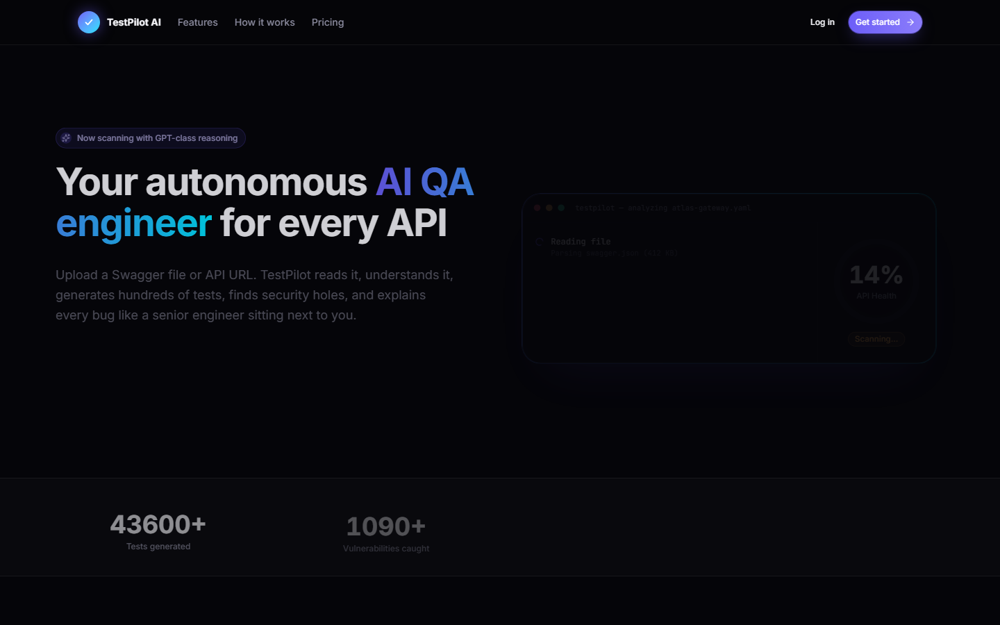
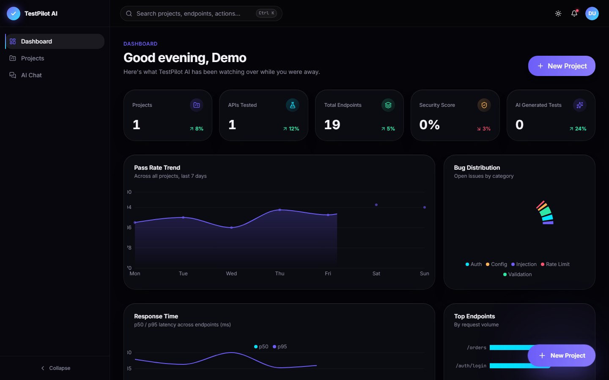
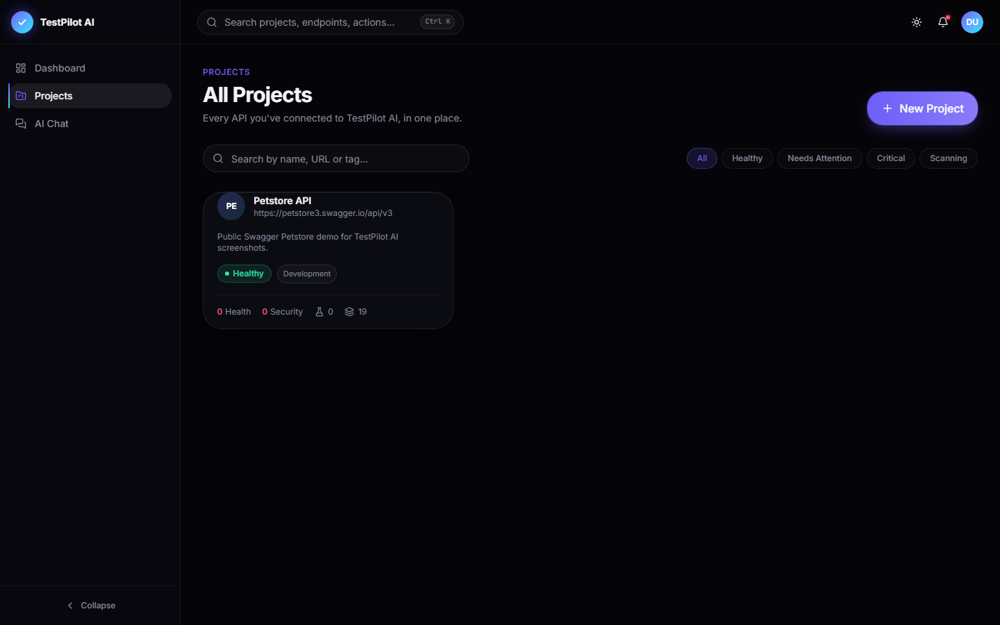
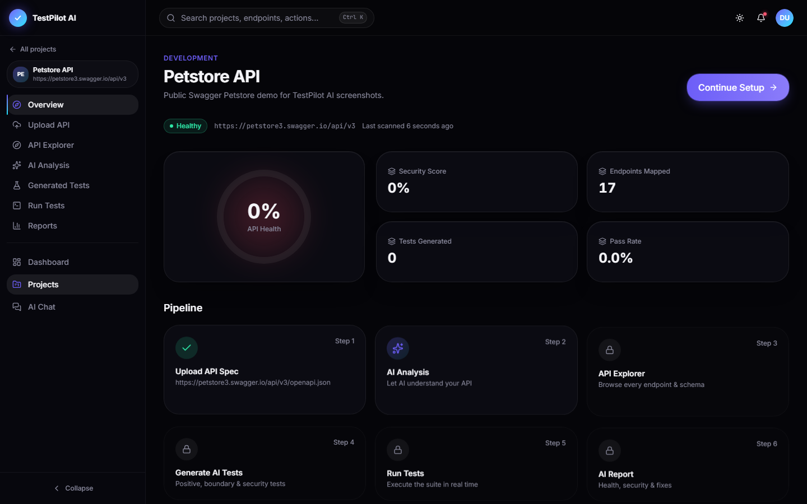
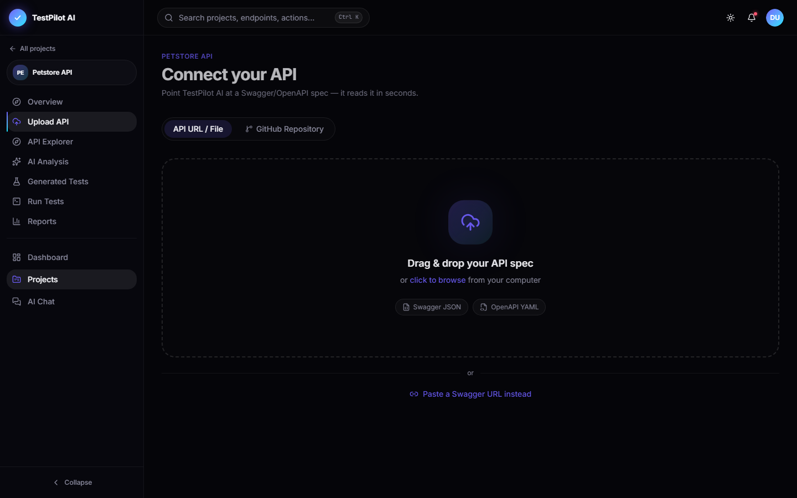
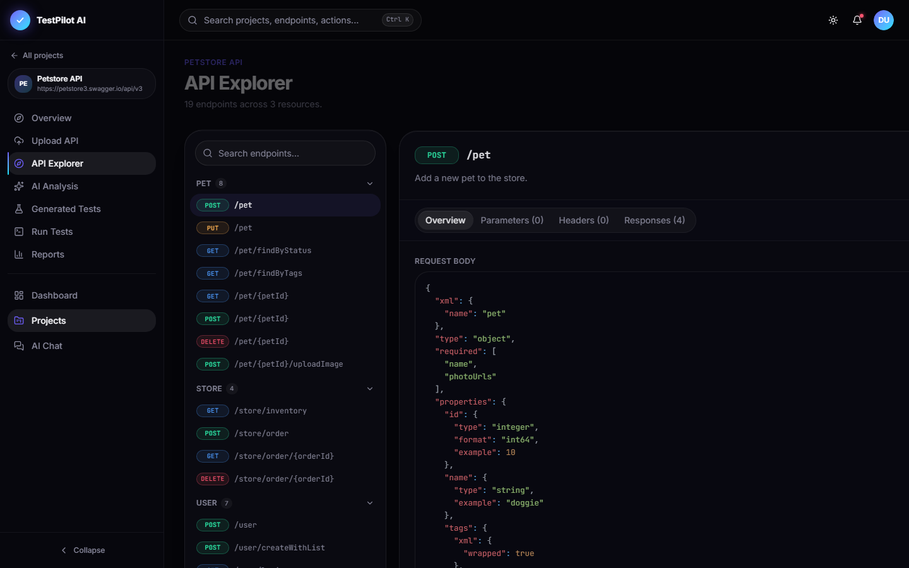

# TestPilot AI

**Your autonomous AI QA engineer for every API.**

Point TestPilot AI at an OpenAPI/Swagger spec (URL, file upload, or a GitHub repo) and it reads the API, maps every endpoint, and uses an LLM to generate positive, negative, boundary, security, and auth test cases automatically. It then runs the suite, scores the API on health/security/coverage/performance, and surfaces findings with severity and remediation guidance — no test scripts written by hand.



## Why

Writing API test suites by hand is slow and the coverage is only as good as the person writing it. TestPilot AI treats an OpenAPI spec as ground truth, has an LLM reason about each endpoint the way a senior QA engineer would (auth requirements, boundary values, injection surface, missing validation), and turns that reasoning into executable tests and a scored report — end to end, without manual test authoring.

## How it works

1. **Connect** — paste a spec URL, upload a Swagger/OpenAPI file, or point at a GitHub repo.
2. **Scan** — the backend parses the spec and maps every endpoint, method, and auth scheme.
3. **AI Analysis** — Gemini reviews each endpoint for quality issues, missing validation, and security concerns.
4. **Generate tests** — the AI produces positive, negative, boundary, security, and auth test cases per endpoint, validated against a strict schema (invalid AI output is retried, never trusted blindly).
5. **Run** — the suite executes against the live API through a Redis-backed job queue, with SSRF-guarded outbound requests and response redaction.
6. **Report** — health, security, coverage, and performance scores are computed from real run results, plus AI-written insights and findings by severity.

## Screenshots

| | |
|---|---|
| **Dashboard** — cross-project KPIs, pass-rate trend, bug distribution, latency |  |
| **Projects** — every connected API with live health/security scores |  |
| **Project pipeline** — upload → analyze → explore → generate → run → report |  |
| **Connect API** — drag & drop a spec, paste a URL, or import from GitHub |  |
| **API Explorer** — full endpoint tree with parsed request/response schemas |  |

## Tech stack

**Frontend** — React 19, TypeScript, Vite, Tailwind CSS, Radix UI, TanStack Query, Zustand, React Router, Recharts, React Hook Form + Zod.

**Backend** — Node.js, Express, TypeScript, Prisma + PostgreSQL, BullMQ + Redis (background job processing for scans, AI analysis, test generation, and test runs), JWT auth, Helmet, rate limiting.

**AI** — Google Gemini via `@google/genai`, with schema-validated, retry-on-failure output parsing so generated tests and analyses can never corrupt the database.

**Testing** — Vitest, with unit coverage on auth, OpenAPI parsing, route scanning, SSRF protection, response redaction, report scoring, and AI output validation.

**Infra** — Docker Compose for local Postgres/Redis, deployment configs for Render (API) and Vercel (frontend).

## Data model highlights

- **Projects** track a scanned API's health score, security score, and status (`scanning` / `healthy` / `warning` / `critical`).
- **Endpoints** store parsed parameters, request body schema, and responses straight from the spec.
- **GeneratedTest** records are categorized (`positive` / `negative` / `boundary` / `security` / `auth`) with a severity, so a failing test maps directly to a **Finding**.
- **Reports** snapshot health/security/coverage/performance scores plus AI insights for every test run.
- **Job** rows track async work (`analyze_url`, `analyze_endpoints`, `generate_tests`, `run_tests`) through a queued → processing → completed/failed lifecycle so the UI can show live progress.

## Running locally

```bash
# Postgres + Redis
docker compose up -d

# Backend
cd server
cp .env.example .env   # fill in DATABASE_URL, REDIS_URL, GEMINI_API_KEY, JWT_SECRET
npm install
npm run prisma:migrate
npm run dev

# Frontend (from repo root)
npm install
npm run dev:all         # runs frontend + backend together
```

Backend tests: `cd server && npm test`

## Security-conscious design

- SSRF protection on every outbound scan/fetch (`server/src/utils/ssrf.ts`)
- Response body/header redaction before persistence (`server/src/utils/redact.ts`)
- AI output is schema-validated with bounded retries before it ever reaches the database — a malformed or hallucinated response fails loudly instead of silently corrupting data
- JWT auth, Helmet, and per-route rate limiting on the API
